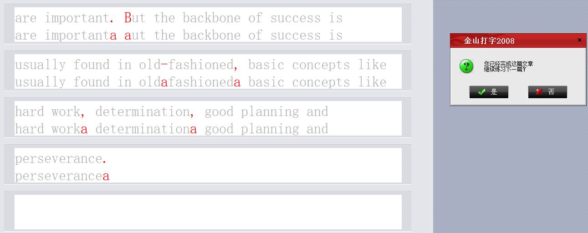

这是我的软件库（目前只有南京外国语学校的）
1. [JiYu Trainer](/files/JiYuTrainer.exe)
2. [金山打字通自动打字](/files/tyeasyhelper.zip)

任何软件有问题请邮箱私信我。

<h2>NFLS专栏</h2>
<h3>NFLS机房科普</h3>

南外机房均使用极域电子教室，并使用不同机制的网络封锁系统。

<h3>破解极域（涉及到DLL注入，可能会报毒）</h3>

经过本人的苦心搜索，终于找到一款终极杀手——JiYu Trainer

它可以轻松控制极域


软件内附详细说明，一般不用更改设置。

#### FTP
同时，你也可以进ftp://192.168.188.111获取它。

Steps:
1. 进入ftp://192.168.188.111
1. 登录。账号：stuzy 密码：stuzy
1. 进入 暂存\初一（10）班\夏宇轩（这不是我，我只是借放在他那里）
1. 下载JiYu Trainer.exe
1. 运行
   
<h3>突破封锁（win7）</h3>

戳Win+R，打开运行，输入“netsh winsock reset”即可。

<h3>For new 初一</h3>

if金山打字通让你痛不欲生，不要着急！

首先，十分抱歉的是，您需要自行找到你要打的文章，并复制到helper/article.txt中。

接下来，运行change.exe

随后，双击tyeasyhelper.exe，同时迅速打开打字页面。过一会，它会自动开始打字！（目前只能打小写字母，我会更新）



### U盘解禁（win7）

如果老师封U盘，背下下列代码，到时编译运行即可（Dev-C++）。

```C++
#include<bits/stdc++.h>
#include<windows.h>
using namespace std;
int main()
{
    HINSTANCE instusb=LoadLibrary("C:\\Program Files\\Mythware\\e-Learning Class\\LibTDUsbHook10.dll");
    FARPROC func,fun1,fun2;
    fun1=GetProcAddress(instusb,"TDUsbFilterInit");
    func=GetProcAddress(instusb,"TDUsbFiltFree");
    fun2=GetProcAddress(instusb,"TDUsbFilterDone");
    fun1();
    func();
    fun2();
    return 0;
}
```

#### FTP
同时，你也可以进ftp://192.168.188.111获取它。

Steps:
1. 进入ftp://192.168.188.111
1. 登录。账号：stuzy 密码：stuzy
1. 进入 暂存\初一（10）班\夏宇轩（这不是我，我只是借放在他那里）
1. 下载U.exe
1. 运行